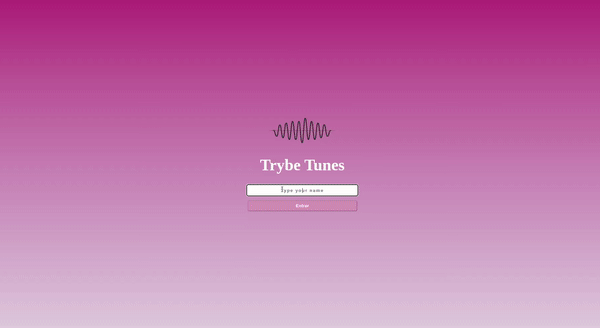

## **Bem-vindo ao repositório do projeto Trybetunes**

### Trybetunes

### Contexto
No projeto Trybetunes foi desenvolvido uma aplicação...

### Tecnologias utilizadas
Projeto desenvolvido utilizando React...

### Como utilizar a aplicação
- Acesse o link do deploy <a href="https://trybe-tunes-pymx.vercel.app/">Aqui</a>
- Na página de Login digite um nome de usuário;
- Ou dê um git clone no repositório do projeto;
- Entre na pasta da aplicação, instale as dependências com npm install e inicie a página com npm start;

##### Observações:
###### Este projeto foi requisitado pela Trybe ao longo da formação do curso de Desenvolvimento Web, para avaliação do conhecimento adquirido no módulo de Front-end. Todos os aquivos dentro da pasta src foram desenvolvidas por mim, exceto os teste, os outros arquivos foram desenvolvidas pela Trybe.
